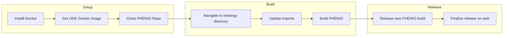

# Building PHENIO from Scratch

Follow these steps to build PHENIO.

1. Install Docker Engine on your system. Instructions for this step will vary by operating system, but can be found here: <https://docs.docker.com/engine/install/>

2. Retrieve the ODK Docker image with `docker pull obolibrary/odkfull`

3. Clone the PHENIO repository with `git clone https://github.com/monarch-initiative/phenio.git`

4. Navigate to `phenio/src/ontology`

5. Update imports with `sh run.sh make refresh-imports`. You may have to run this and the following commands with `sudo` depending on how you installed Docker.

6. Build ontology artifacts with `sh run.sh make all_release`.

7. Create a draft GitHub release with `sh run.sh make public_release`. This release will need to be finalized on the repository web interface.
